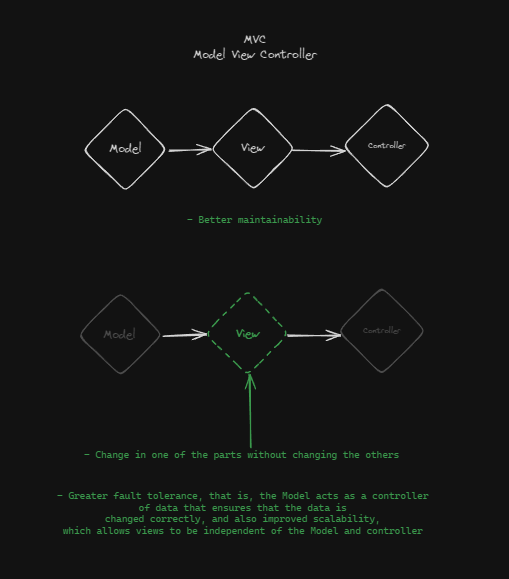

# Use Case

- How architecture  application MVC with React Native

## Advantage
- Better maintainability

- Change in one of the parts without changing the others

- Greater fault tolerance, that is, the Model acts as a controller
of data that ensures that the data is
changed correctly, and also improved scalability,
which allows views to be independent of the Model and controller

## Disadvantage

-  Complicated testability, due to the high relationship with the View Layer
- - High complexity in the Controller layer, as over time the code is transferred to the Controller layer.

- 
## Examples

 
 
 
<h1>You can view how is it separation in this repository <strong>Pattern/MVC</strong> </h1>

